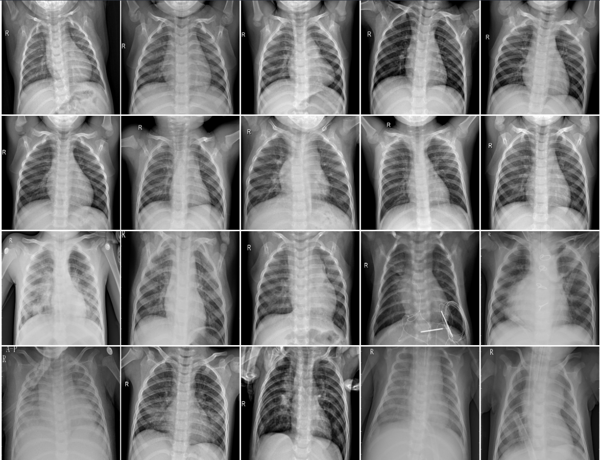
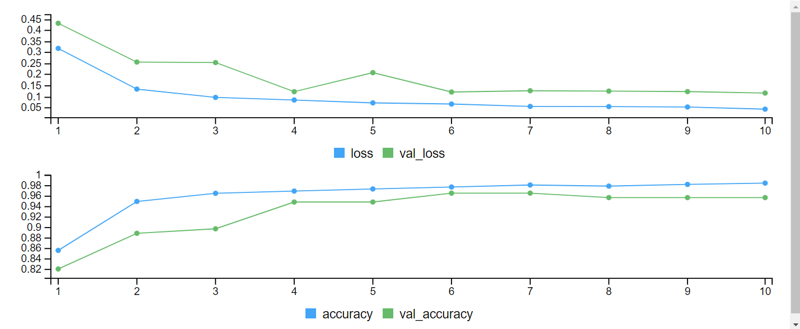
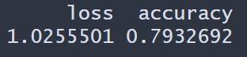

# Convolutional Neural Network Chest-XRay Pneumonia images 

In this project, Convolutional Neural Network (CNN) was used to classified normal and pneumonia lungs in X-ray images. The data can be found [here](https://www.kaggle.com/datasets/paultimothymooney/chest-xray-pneumonia)

The data set contains a total of 5,863 X-ray images and the two categories  Pneumonia and Normal. The chest X-rays images were screen for quality control and grade by three expert physicians.

The images below shows a random sample of 10 normal and 10 pneumonia lungs.

The training set contains 5116 X-rays images, the validation set  has 116 X-rays images and the test set has 624 images.

The CNN model accuracy and loss on the  training is shown below. Based on the figure the model does relative well classifying the validation data.

The figure below shows the accuracy on the testing data. The CNN model does pretty well with accuracy around 79.3% in classifying normal and pneumonia lungs from X-rays.

